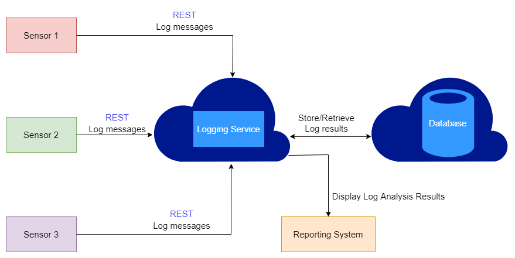

[comment]: # "This is the standard layout for the project, but you can clean this and use your own template"

# Logging Microservice for IoT based Smart Agriculture Project

---

## Team
-  E/18/118, Haritha Gunarathna, [email](mailto:e18118@eng.pdn.ac.lk)
-  E/18/149, Ishta Jayakody, [email](mailto:e18149@eng.pdn.ac.lk)
-  E/18/150, Yojith Sandaruwan, [email](mailto:e18150@eng.pdn.ac.lk)

## Table of Contents
1. [Introduction](#introduction)
2. [Technology Stack](#technology_stack)
3. [Links](#links)

---

## Introduction

In this project we are aiming to design a data store for a logging service along with associated generic services using a suitable programming language for IIoT solutions.By this the loggers will be able to discover anomalies in operations via audit analysis using different ML-based techniques. 

## Technology Stack

Database - MongoDB Atlas
REST API - SpringBoot

---

## Links

- [Project Repository](https://github.com/cepdnaclk/{{ page.repository-name }}){:target="_blank"}
- [Project Page](https://cepdnaclk.github.io/{{ page.repository-name}}){:target="_blank"}
- [Department of Computer Engineering](http://www.ce.pdn.ac.lk/)
- [University of Peradeniya](https://eng.pdn.ac.lk/)

[//]: # (Please refer this to learn more about Markdown syntax)
[//]: # (https://github.com/adam-p/markdown-here/wiki/Markdown-Cheatsheet)
